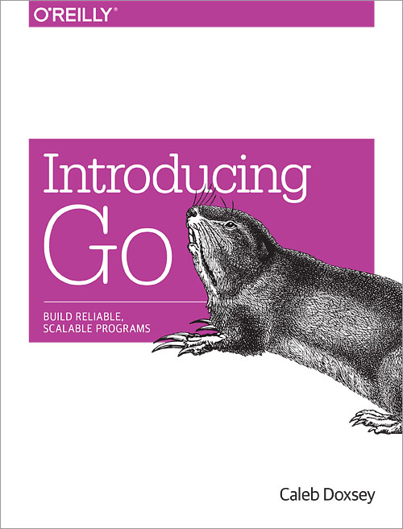

# Learning Go [![Build Status][travis-img]][travis]

Learning Go using book **"Introducing Go"**, written by Caleb Doxsey, and other
online materials.

  

## Installation

Install Go on macOS:

    $ brew install go

Check Go version:

    $ go version

## Testing

Run test:

    $ go test

Run test with verbose mode:

    $ go test -v

## Code Style

The source code is formatted automatically using
[gofmt](https://golang.org/cmd/gofmt/) tool:

    $ go fmt

## References

- Dan Buch, "travis-ci-examples/go-example", _GitHub_, 2019.
  <https://github.com/travis-ci-examples/go-example>
- Go, "Package testing", _Golang_, 2019.
  <https://golang.org/pkg/testing/>
- Andrew Gerrand, "go fmt your code", _Golang_, 2013.
  <https://blog.golang.org/go-fmt-your-code>
- Mark McGranaghan, "Go by Example", _gobyexample_, 2019.
  <https://gobyexample.com/>

[travis]: https://travis-ci.org/mincong-h/learning-go
[travis-img]: https://travis-ci.org/mincong-h/learning-go.svg?branch=master
